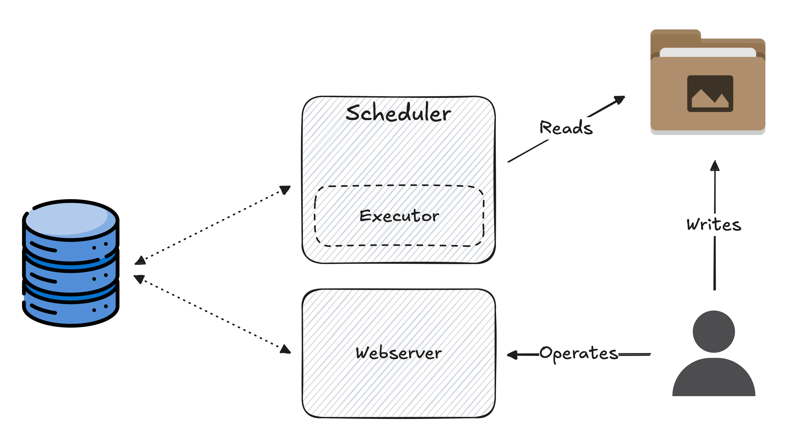

***
Apache Airflow es una plataforma de orquestación que nos permite desarrollar, programar y monitorear nuestros flujos de trabajo. Está especialmente orientada a trabajos de tipo **batch**[^1]. También cuenta con una UI web que nos permite visualizar y monitorear en tiempo real nuestros trabajos.

Los trabajos están representados por un **DAG (Directed Acyclic Graph)**, compuesto por unidades discretas de trabajo llamadas **Tasks**, el cual se encarga de definir las dependencias entre las tareas, es decir, define el orden en el que deben ser ejecutadas.
<figure>
	
	<figcaption><b>Figura 1. Estructura simple de un Dag</b></figcaption>
</figure>

[^1]: Un pipeline de datos es de tipo **batch** si procesa los datos en grupos (o batches) y de manera periódica (e.g., cada una hora, una vez al día, etc.). Por otro lado, un pipeline de datos es de tipo **stream** si procesa los datos en (casi) tiempo real y de forma continua.

## 🏗️ Arquitectura

Airflow consiste de múltiples componentes. Algunos de ellos son necesarios para el correcto funcionamiento del orquestador, mientras que otros son componentes opcionales que podemos utilizar para mejorar la performance de nuestro procesos.

### 🔩 Componentes necesarios

Dentro de los componentes necesarios para el correcto funcionamiento de Airflow tenemos:
- **Scheduler.** Es el motor principal de Airflow y el encargado de ejecutar los flujos de trabajo y programar la ejecución de las tareas.
	- **Executor**. El *scheduler* por si solo no ejecuta las tareas. El encargado de efectivamente ejecutar las tareas es el **executor**, que es un componente dentro del *scheduler*. 
		- Hay varios tipos disponibles, aunque se pueden crear otros en caso de necesitarlo.
- **Dag processor**. Se encarga de procesar los DAGs, serializarlos, y guardarlos en la base de datos.
- **Metadata database.** Guarda toda la información relacionada con el estado del flujo de trabajo actual y las tareas ya ejecutadas.
	- Es necesario tener una base de datos configurada para poder correr Airflow.
<figure>
	
	<figcaption>Figura 2. Estructura simple para un flujo de trabajo en Airflow</figcaption>
</figure>

## 📚 Recursos
- Airflow documentation. [Architecture Overview](https://airflow.apache.org/docs/apache-airflow/stable/core-concepts/overview.html#workloads).