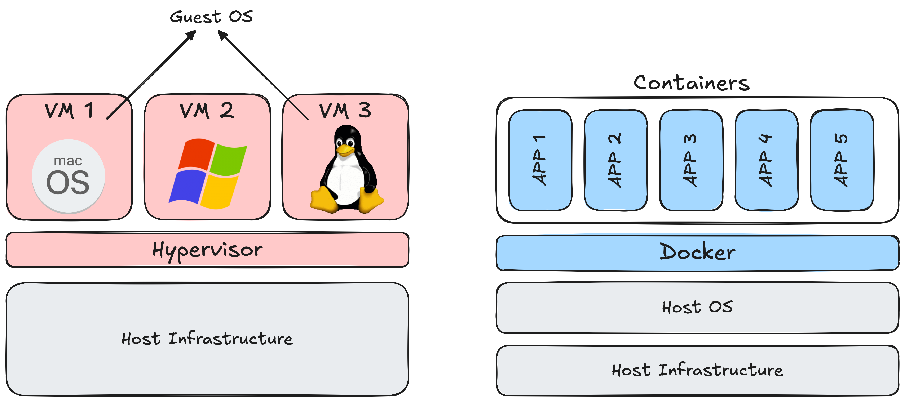
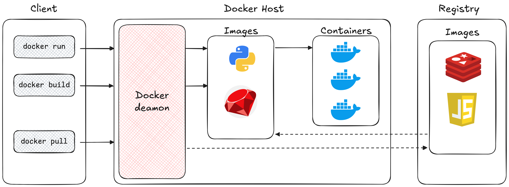

***

# Introducción

Docker es una plataforma que nos permite desarrollar, probar y poner en producción nuestras aplicaciones, sin tener que preocuparnos por nuestra infraestructura. 
Con Docker, podemos empaquetar nuestras aplicaciones en entornos aislados, que llamados **contenedores**, y que incluyen todo lo necesario para ejecutarlas: código, dependencias, sistema operativo y más. 
Estos contenedores también facilitan su distribución: en lugar de compartir nuestro código con otras personas, compartimos un entorno de ejecución completo y listo para su uso, lo que nos garantiza que cualquier persona pueda ejecutar nuestra aplicación, sin importar la infraestructura que tenga.

## Contenedores vs. Máquinas Virtuales

Si bien ambas soluciones nos permiten crear entornos aislados para ejecutar nuestras aplicaciones, son distintas entre sí:
- Una **máquina virtual** es una computadora que se está ejecutando dentro de nuestra computadora física. A nivel *software*, una máquina virtual es completamente independiente de la computadora anfitriona (computadora física), ya que tiene su propio sistema operativo y sus propias aplicaciones. Lo único que comparte con la computadora anfitriona es el *hardware*.
	- Se crean a través de un software llamado _hipervisor_, el cual está encargado de comunicarlas con el hardware.
	- Las máquinas virtuales son como departamentos en un edificio. Al igual que un departamento tiene una cocina, un baño, una habitación, independiente del resto de los departamentos del edificio; las máquinas virtuales tienen su propio sistema operativo, su propias librerías, sus propias aplicaciones, que son independientes del resto de las máquinas virtuales en el anfitrión. Y al igual que los departamentos, que dependen de la infraestructura principal del edificio, las máquinas virtuales dependen del hardware de la máquina anfitriona.
- Un contenedor de Docker, por otro lado, es una versión mucho mas ligera de una máquina virtual, principalmente porque no contiene un sistema operativo completo. A diferencia de las máquinas virtuales, los contenedores de Docker comparten el sistema operativo con la computadora anfitriona (para ser más precisos, comparten su kernel), y dentro de ellos solo vamos a encontrar lo necesario para ejecutar la aplicación.
	- Los contenedores son como habitaciones de un hotel, es decir, tienen todo lo necesario para poder vivir temporalmente, pero están limitados en los recursos que tienen disponibles.
<figure>
	
	<figcaption>Figura 1. Comparación entre las máquinas virtuales y los contenedores de Docker.</figcaption>
</figure>
### Principales diferencias
- **Eficiencia de recursos.** Las máquinas virtuales requieren de muchos recursos debido a que tienen que ejecutar un sistema operativo completo. Por otro lado, los contenedores de Docker solo necesitan los recursos necesarios para ejecutar la aplicación.
- **Tiempos.** Los contenedores de Docker están disponibles casi al instante, a diferencia de las máquinas virtuales que tienen que inicializar un sistema operativo completo, lo que puede llegar a tardar varios minutos.
- **Aislamiento.** Como mencionamos anteriormente, las máquinas virtuales tienen su propio sistema operativo distinto al del anfitrión, lo que nos asegura un mayor aislamiento. Esto hace que, para algunas aplicaciones, sean más seguras que los contenedores de Docker.
- **Portabilidad.** Las máquinas virtuales suelen ser más pesadas que los contenedores, lo que hace que su portabilidad sea más compleja.

## Arquitectura

Docker utiliza una arquitectura de *cliente-servidor*, los cuales se comunican a través de una REST API. 
El cliente es la manera que los usuarios tienen de comunicarse con la API de Docker. Cuando el usuario ejecuta un comando (e.g., `docker run`), el cliente realiza una llamada a la API de Docker, la cual es escuchada por el servidor, llamado Docker deamon (`dockerd`). El servidor se encarga de manejar las imágenes, los contenedores, los volúmenes, entre otros, que sean necesarios para poder responder a la llamada del cliente (en este caso, ejecutar un contenedor).
<figure>
	
	<figcaption>Figura 2. En esta figura podemos ver como cuando el usuario ejecuta comandos (como `docker run` y `docker build`), el cliente se comunica a través de la REST API de Docler con el servidor (Docker deamon), quien se encarga de crear las imágenes y ejecutar los contenedores.
	</figcaption>
</figure>
# 📚 Recursos
- Docker documentation: [_What is Docker?_](https://docs.docker.com/get-started/docker-overview/#responsive-deployment-and-scaling).