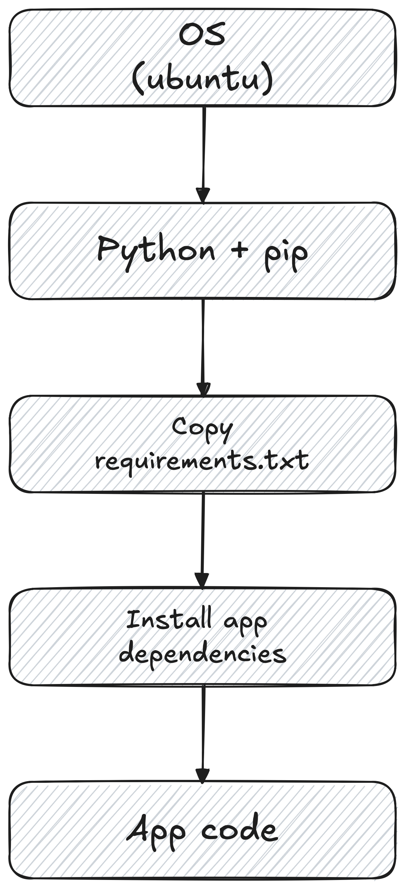

***

# 📦 Contenedores

Los **contenedores** de Docker son ambientes aislados en donde podemos ejecutar nuestras aplicaciones (o procesos) y sus distintos componentes. Por ejemplo, podemos tener un contenedor para ejecutar el front-end que desarrollamos con React, otro contenedor para ejecutar el back-end que desarrollamos con Python, y otro contenedor para ejecutar nuestra base de datos de PostgreSQL. En ese caso, cada componente se va a ejecutar de manera aislada e independiente del resto.

## ✅ Ventajas

- La principal ventaja de los contenedores es que poseen todo lo necesario para ejecutar nuestra aplicación, independiente de la máquina anfitriona. Esto nos asegura que cada componente de nuestra aplicación se está ejecutando de manera aislada, sin ser afectada (o sin afectar) al resto de los componentes que se están ejecutando en otros contenedores.
- Se manejan de manera independiente. Esto quiere decir que si borramos un contenedor, los demás no se ven afectados.
- Son portables y se pueden ejecutar en cualquier computadora (ya sea local, en un servidor físico o en la nube).

## Ejecutar un contenedor

El comando para ejecutar un contenedor es el siguiente:
```zsh
docker run [OPTIONS] IMAGE[:TAG|@DIGEST] [COMMAND] [ARG...]
```

Hay varios componentes importantes:
- Como veremos más adelante, para ejecutar un contenedor necesitamos una _imagen_ de referencia (el contenedor lo vamos a crear a partir de esta _imagen_).
	- El flag `IMAGE[:TAG|@DIGEST]` nos permite definir el nombre y el tag (versión) de la imagen a partir de la cual vamos crear el contenedor. Si no especificamos la versión, se utiliza la última versión disponible (`latest`).
	- Por ejemplo, si quisiéramos ejecutar un contenedor utilizando la versión `24.04` de Ubuntu, deberíamos ejecutar el siguiente comando: `docker run ubuntu:24.04`.
- `[OPTIONS]` nos permite configurar nuestro contenedor. Por ejemplo, podemos ejecutar nuestro contenedor como un proceso en background (`-d`, `--detach`) o  podemos ponerle un nombre (`--name`). La lista completa de opciones se encuentra en la [documentación](https://docs.docker.com/reference/cli/docker/container/run/). Algunos comandos útiles son:
	- `-d` para correr el proceso en background.
	- `-p` hace accesible los puertos del contenedor, así podemos acceder al proceso que se está ejecutando desde Safari. Debemos primero especificar los puertos, `<host-port>:<container-port>`, y luego acceder desde `http://localhost:<host-port>`

## 📚 Recursos
- [What is a container?](https://docs.docker.com/get-started/docker-concepts/the-basics/what-is-a-container/). Docker docs.
- [Running containers](https://docs.docker.com/engine/containers/run/). Docker docs.
***

# 🏞️ Imágenes

Los contenedores de Docker se crean a partir de una **imagen**. Una imagen es un paquete que contiene todo lo necesario para ejecutar un contenedor (archivos, librerías, configuraciones, etc.). Hay que pensar a los contenedores como un plato de comida, y a la imagen como la receta necesaria para cocinar ese plato.
Hay dos principios importantes a tener en cuenta:
- Las imágenes se construyen utilizando un sistema llamado "union mount filesystem". Esto quiere decir que van a estar compuestas por capas, donde cada capa representa un cambio en el sistema -agregar, remover o modificar archivos-.
	- Este principio es muy importante ya que nos permite agregar funcionalidades a nuestras imágenes de manera muy sencilla. Por ejemplo, si estamos trabajando en una aplicación de Python y queremos crear un contenedor que la ejecute, podemos usa de la imagen base de Python, y a partir de ella ir agregando capas que realicen cambios en el sistema (e.g., instalen las dependencias y copien el código).
	- Estas capas son de tipo *read-only*, lo que quiere decir que una vez creadas no pueden ser modificadas. Esto nos asegura que al ejecutar el contenedor ninguna capa pueda modificar o remover archivos[^1].
- Las imágenes son **inmutables**. Esto quiere decir que, una vez creada la imagen, no la vamos a poder modificar.
	- Si quisiéramos hacer algún cambio deberíamos crear una nueva imagen o agregar los cambios sobre la imagen actual (es decir, agregar nuevas capas). 

<figure>
	
	<figcaption><b>Figura 1. Explicación gráfica de como funcionan las capas en las imágenes.</b> <br>Supongamos que estamos creando una imagen para ejecutar una aplicación de Python. Para eso, deberíamos comenzar por la capa que contiene el kernel del sistema operativo (e.g., Ubuntu). Luego, añadimos una capa que instala Python 3.12 y <code>pip</code> para el manejo de dependencias. Agregamos una capa que copia el archivo <code>requirements.txt</code>, para que la siguiente capa pueda instalar las dependencias incluidas en ese archivo. Por último, agregamos una capa que copia el código de nuestra aplicación.</figcaption>
</figure>

## 📝 Dockerfiles

Las imágenes se crean a través de un **Dockerfile**. Un Dockerfile es un documento, similar a un documento de texto, que contiene todos los comandos que necesita Docker para crear una imagen.

### Comandos

Algunos de los comandos más utilizadas son:
- `FROM <image>`. Especifica la imagen base a partir de la cual queremos construir nuestra imagen. Por lo general, todos los Dockerfiles que armemos van a comenzar con este comando.[^1]
- `WORKDIR <path>`. Define el directorio de trabajo de la imagen. Acá es donde se copian los archivos y se ejecutan los comandos. Un directorio muy utilizado es `/usr/local/app` o simplemente `/app`.
- `COPY <host-path> <image-path>`.  Especifica a Docker los archivos que queremos copiar, desde `<host-path>` hasta `<image-path>`.
- `RUN <command>`. Especifica el comando que queremos correr.
- `ENV <name> <value>`. Define variables del ambiente que el container va a utilizar.
- `EXPOSE <port-number>`. Configura los puertos que se quieren exponer en una imagen.
- `USER`. Define los usuarios predeterminados para las instrucciones (a partir de ese punto).
- `CMD ['<command>', '<arg1>']`. Define el comando que se ejecuta al correr un container.
	- No hay que confundir este comando con comandos como `RUN`. El comando `RUN` se ejecuta durante la creación de la imagen, creando una nueva capa. Por otro lado, el comando `CMD` se ejecuta al correr un contenedor, y no crea una nueva capa a la imagen (porque ya está creada).
## ⚙️ Crear una imagen

Para crear una imagen, tenemos que correr el comando `docker build .`, donde `.` especifica el directorio en donde se va a encontrar el Dockerfile y todos los archivos de referencia.

### 🏷️ Tags

Podemos ponerle un nombre a nuestras imágenes utilizando el flag `-t` o `--tag`. Los nombres de las imágenes tienen la siguiente estructura:
```zsh
[HOST[:PORT_NUMBER]/]PATH[:TAG]
```
donde:
- `HOST` hace referencia al repositorio de imágenes en donde está guardada la imagen. Por defecto se utiliza el repositorio público de Docker, `docker.io`.
	- Si se utiliza Docker Hub para guardar las imágenes, esta parte puede ser omitida (ya que por defecto se elige este repositorio). Si, por otro lado, se utiliza otro repositorio de imágenes, como los de algún proveedor cloud (e.g., GCP), o si se utiliza un repositorio privado, si es necesario definir el repositorio donde queremos guardar la imagen.
- `PORT_NUMBER` hace referencia al puerto del host en caso de que se haya especificado.
- `PATH` hace referencia a la ruta de la imagen. En Docker Hub, el path tiene sigue el formato `[NAMESPACE/]REPOSITORY`, donde `NAMESPACE` es el nombre del usuario (o una organización) y `REPOSITORY` es el nombre del repositorio/imagen.
	- Si no se especifica un `NAMESPACE`, se utiliza `library` por defecto.
- `TAG` es comúnmente usado para identificar la versión de una imagen. Por defecto se usa `latest` en caso de que no se haya especificado.

Por ejemplo, si quisiéramos crear una imagen para la versión `v1.2.4` de `python-app` en Docker Hub, deberíamos ejecutar el siguiente comando:
```zsh
docker build -t docker.io/nicokossacoff/python-app:v1.2.4 .
```
o su forma reducida:
```zsh
docker build -t nicokossacoff/python-app:v1.2.4 .
```

### Publicar imágenes

Una vez creada la imagen, podemos publicarla en el repositorio. Para eso, tenemos que correr el siguiente comando:
```zsh
docker push nicokossacoff/python-app:v1.2.4
```

[^1]: Sin embargo, cuando ejecutamos un contenedor, se crea una capa llamada *Writable Container Layer*. Esta capa es la encargada de guardar todas las modificaciones que se generaron durante la ejecución del proceso (i.e., guarda información sobre los archivos creados, modificados o eliminados). Al apagar el contenedor, todos los cambios son descartados.
[^2]: Por lo general, vamos a usar la imagen base de Python (e.g., `python:3.10-slim`) para crear nuestras imágenes. Sin embargo, si en nuestra computadora usamos `conda` para crear los ambientes virtuales, es recomendable usar `continuumio/miniconda3` como imagen base.
## 📚 Recursos
- Docker documentation. [What is an image?](https://docs.docker.com/get-started/docker-concepts/the-basics/what-is-an-image/).
- Docker documentation. [Understanding image layers](https://docs.docker.com/get-started/docker-concepts/building-images/understanding-image-layers/).
- Docker documentation. [Writing a Dockerfile](https://docs.docker.com/get-started/docker-concepts/building-images/writing-a-dockerfile/).
- Docker documentation. [Build, tag, and publish an image](https://docs.docker.com/get-started/docker-concepts/building-images/build-tag-and-publish-an-image/).
***
# Extras

## 🧪 Crear una imagen de Docker usando `conda`

Lo primero que tenemos que hacer es definir `continuumio/miniconda3` como la imagen base. Luego, copia el archivo `environment.yml` (que contiene todas las dependencias instaladas por `conda`), lo guarda dentro de nuestra imagen en la carpeta `/tmp/` y crea el ambiente virtual.
Después activa el ambiente virtual, usando el comando `SHELL`, y copia todos los archivos de nuestro proyecto en la carpeta `/app`, la cual define como directorio principal. Por último, define el comando que se va a ejecutar cuando se cree el contenedor.

```
FROM continuumio/miniconda3

# Create environment
COPY environment.yml /tmp/environment.yml
RUN conda env create -f /tmp/environment.yml

# Activate environment
SHELL ["conda", "run", "-n", "myenv", "/bin/bash", "-c"]

# Copy code
COPY . /app
WORKDIR /app

CMD ["python", "main.py"]
```