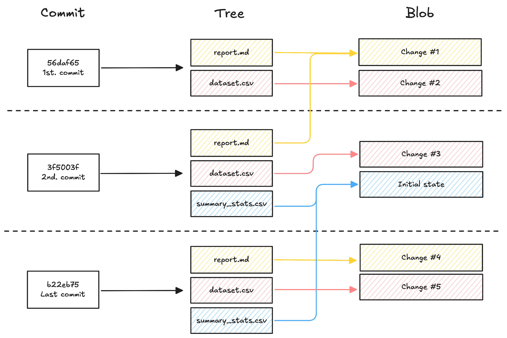
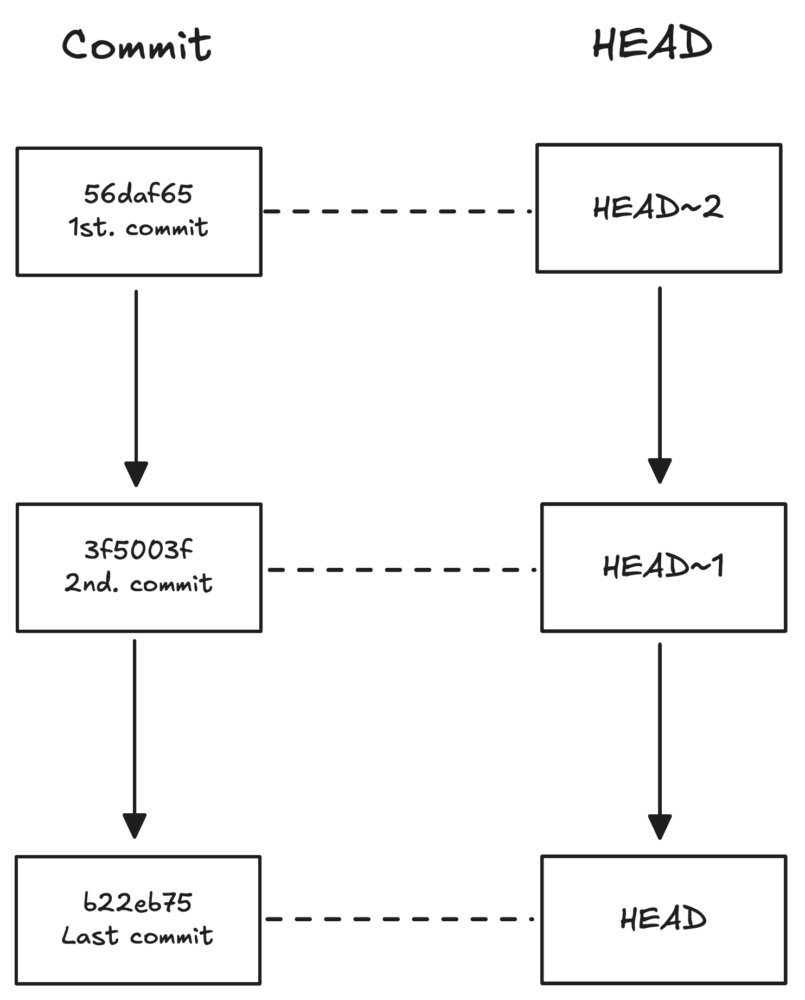

***
# The Commit Structure

Each commit has three parts:
1. The **commit** itself, which contains the metadata for that particular commit such as the author, the commit message and the time of commit.
2. The **tree** tracks the names of the files and their location when the commit happened.
3. For each file in the tree there is a **blob (binary large object)** that contains a snapshot of the contents of the file at the moment it was committed.

In the following figure we have a visual representation of the commit structure:
1. In the first commit, we modified the `report.md` and the `mental_health_survey.csv`. For each file we have a blob file containing all the changes we made.
2. In the second commit, we modified the `mental_health_survey.csv` file and we added a new file called `summary_statistics.csv`, each one with a new blob file. The `report.md` files was not modified on this commit so it's linked to the previous blob file.
3. The same happened in the final commit. We only modified the `report.md` and `mental_health_survey.csv` files, so the `summary_statistics.csv` file is linked to the previous blob file.
<figure>
	
</figure>
## Git log command

We can see all the commits that were made to the repo in chronological order with the following command:
```zsh
git log
```
The output will contain the hash (a 40-digits code used by Git to compare commits), the author, the date and the commit message.
### Customizing output

- We can limit the number of commits on the output by adding a `-` after the command. For example, the following command will return the last three commits made:
```zsh
git log -3
```
- We can also restrict the output so it only shows the last commits of a specific file by adding its name at the end of the command:
```zsh
git log -3 file-name
```
- We can restrict the output so it only shows the last commits after a particular date using the `--since` flag. If we add the `--until` flag, it will show the commits made between the two dates:
```zsh
git log --since='Apr 2 2022'
git log --since='Apr 2 2022' --until='Apr 11 2022'
```
## Finding a commit

Suppose you want to find an error that was committed on a certain date. You will have to first use the `git log` command to find all commits made on that date. After that, with the first 6-8 characters of the hash, you will run the following command:
```zsh
git show c27fa856
```
This will show you the commit linked to that hash code.
***
# Comparing Commits
## Comparing staged files with previous commits

We can compare the staged files with the version in a specific commit by adding a tilde `~` in the `git diff` command.
```zsh
git diff -r HEAD~1
```
The `HEAD` flag compares the staged files with the last commit, the `HEAD~1` compares the staged files with the second most recent commit, and so on. The following diagram shows how the `HEAD` flag maps to the commits:
<figure>
	
</figure>
We can also use the `HEAD~` flag with the `git show` command to avoid using the hash:
```zsh
git show HEAD~3
```
## Comparing two commits

Suppose we want to compare the two most recent commits. We can either use the `git diff` command with the hash code for each commit:
```zsh
git diff a845edcb ebe93178
```
or we can use the `HEAD` flag with a tilde and the numbers associated with those commits:
```zsh
git diff HEAD HEAD~1
```
## Changes per-document

If we want to see the changes made in each line of a document, we must use the `git annotate` command followed by the file name.
```zsh
git annotate report.md
```