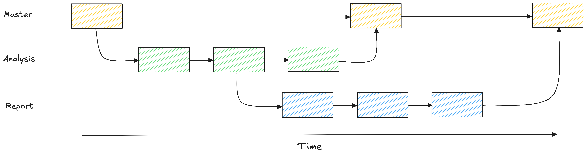

***
# Introduction

Branches allows you to have and systematically track multiple versions of the same repository.

> A branch is like a _parallel universe_. Some files are the same, others are modified and others don't even exist when we compare branches.

When you create a branch, you clone the state of the repository at that time. You can work on that branch without changing any files in the `master` branch (this branch is created with the repo) and then, once you're done working, you can merge branches. Here's a visual representation of this process:
<figure>
	
</figure>
You can see the branches in your repo by running the `git branch` command. The asterisk (`*`) next to a branch identifies the current branch.
## Creating a new branch

To create a new branch you have to run the `git checkout` command followed by the `-b` flag and the name of the new brand:
```zsh
git checkout -b new_branch
```
## Compare to branches

To compare two branches you run the `git diff` command followed by the names of the branches that you want to compare.
## Merging branches

When you merge two branches, the commits are called _parent_ commits. One branch is called the _source_ _branch_ (i.e., the branch we want to merge changes from) and the other one is called the _destination branch_ (i.e., the branch we want to merge into).

Branches are usually created to work on specific tasks that we then want to add to our `master` branch.
# Working with Branches

You can switch to a specific branch by running the `git checkout` command followed by the name of the branch:
```zsh
git checkout branch_name
```
To merge two branches we use the `git merge` command followed by the name of the source branch and the name of the destination branch:
```zsh
git merge source destination
```
# Conflicts

A _conflict_ occurs when a file has different contents in different branches, preventing them to merge into a single file. Resolving conflicts could be a very difficult task, so it's always better to prevent them by not modifying the same file in two different branches.