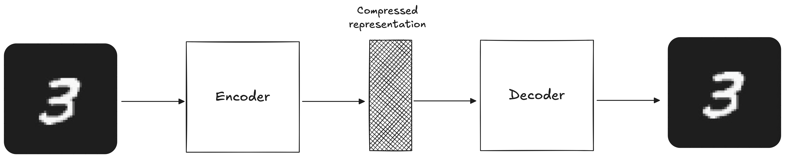
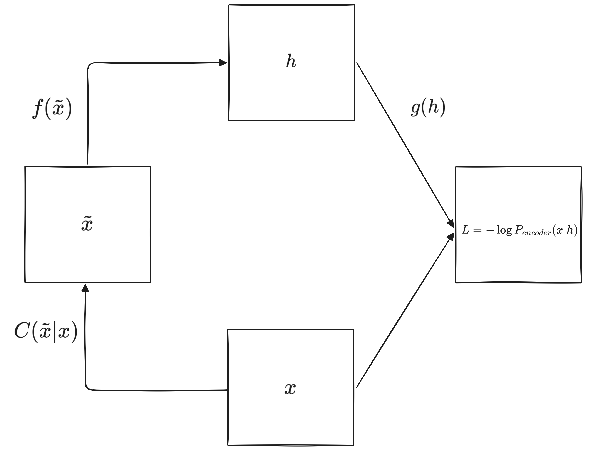

2025-10-18 23:07

Status: #Done 

Tags: [[Autoencoders]]
***
# Introduction

An **autoencoder** is a neural network whose pretext task (i.e., the task for which we train it) is to reconstruct the inputs it receives. 
Its structure consists of two parts:
- The first part is known as the **encoder**, whose task is to learn a lower-dimensional representation (also known as the **latent space**) of the inputs, $h=f(x)$.
- The second part is known as the **decoder**, whose task is to reconstruct the inputs from the latent space learned by the encoder, $\hat{x}=g(h)$.

Gráficamente, la estructura de un autoencoder se representa de la siguiente manera:

The latent space generated by the encoder is known as the "bottleneck", and it is one of the most important attributes in the structure of our model. This "bottleneck" limits the amount of information that can flow through our neural network, thus forcing the model to learn a representation that captures the most important patterns and characteristics in the data. *It's like traveling with a small suitcase, where we can only pack the things we really need.*

Being neural networks, autoencoders are trained using the same techniques we use for a traditional MLP: **back-propagation** to calculate gradients and **stochastic gradient descent** (or any other optimization algorithm) to adjust weights.

Now, a model whose function is to reconstruct the inputs it receives is not particularly useful. What happens is that the reconstruction task is just a pretext task, and what we expect when training an autoencoder is that the representation $h$ contains valuable information about our data.
How can we ensure that the model learns this information? Generally, we design autoencoders so that they cannot reconstruct the inputs perfectly by imposing some type of constraint. By constraining the model, we achieve that it focuses on the most important characteristics for reconstruction, and we prevent it from learning an indicator function that simply copies inputs to outputs[^1].
## Structure: depth and size of hidden layers

The **Universal Approximation Theorem** guarantees us that a neural network with at least one hidden layer can represent, with arbitrary precision, any nonlinear function, as long as it has a sufficient number of neurons.
So, in principle, an encoder with a single hidden layer is sufficient to learn the latent space $h$. 
However, it will not only be limited in the type of transformations it can learn, but it also will not be able to enforce certain properties on the latent space. If we add more hidden layers to our encoder, we could learn more complex transformations and enforce interesting properties on the latent space $h$.

Finally, greater depth allows us to reduce the computational costs of approximating certain functions (i.e., the more hidden layers we have, the fewer neurons we need per layer, which reduces the number of weights in our neural network) and allows us to reduce the amount of data needed for training.
## Stochastic Encoders and Decoders

A very common strategy when designing the output units and loss function of a neural network is to first define a distribution for the output, $P(y|x)$. The loss function must equal minus the log-likelihood of the distribution, $-\log{P(y|x)}$. For example, in cases of binary classification, the loss function $L$ is binary cross-entropy, which we obtain by assuming that $P(y|x)$ follows a Bernoulli distribution.
This same technique can be applied to train autoencoders. So, given the representation $h$ and output $\hat{x}$, the decoder output follows a distribution $P_{decoder}(\hat{x}|h)$. The loss function equals minus the log-likelihood, $-\log{P_{decoder}(\hat{x}|h)}$, whose functional form depends on the assumptions we make about $P_{decoder}(\hat{x}|h)$.

We can also generalize this idea to the encoder, where we assume that its output has the following distribution, $P_{encoder}(h|x)$.
***
# Types of Autoencoders
## Undercomplete Autoencoders

As we mentioned earlier, by applying constraints during training we can make the model capture relevant characteristics about the patterns in the data. One way to do this is to restrict $h$ to have a lower dimension than $x$. This way we force the model to concentrate on the most important features to represent the patterns in the data.

The learning process is the same as that of a traditional neural network, and consists of minimizing a **loss function**:
$$L(x, \hat{x})$$
where $L$ can be any function that penalizes the model when the reconstruction $\hat{x}$ is different from the input $x$.

A key aspect to consider is that if the encoder and decoder are linear and the loss function is mean squared error (MSE), then the autoencoder learns the same **representation** as PCA. However, the advantage that autoencoders have over dimensionality reduction methods like PCA is that, if the encoder or decoder (or both) are nonlinear, even using MSE as a loss function, we can capture a more complex and nonlinear latent space than that of PCA.
Unfortunately, if sufficient constraints are not imposed, even an autoencoder with nonlinear encoder and decoder can learn to reconstruct the data without capturing relevant information in the process. In theory, it could happen that the encoder manages to represent each observation in the training sample, $X$, with an index $i$. In that case, the decoder only has to learn to map the indices $i$ with the observations $x^{(i)}$. This does not happen in practice, but it is a good example of how autoencoders can learn to perform the pretext task without learning anything about the distribution of the data.
## Regularized Autoencoders

Como mencionamos antes, si no se limita la capacidad del encoder y el decoder, el modelo puede aprender a reconstruir los datos sin extraer información útil. 
Idealmente, se podría entrenar exitosamente un autoencoder ajustando la capacidad del encoder y el decoder según la complejidad de la distribución a modelar. Sin embargo, existen diversas técnicas de regularización que nos permiten entrenar autoencoders capaces de capturar información acerca de la distribución de los datos, sin tener que limitar la capacidad del encoder y el decoder. 
Esto se logra modificando la función de pérdida para que el modelo adquiera propiedades adicionales, más allá de simplemente reconstruir los inputs.
### **Sparse Autoencoders**

Los **autoencoders esparsos** nos permiten reducir la cantidad de información que fluye por la red neuronal sin tener que reducir la cantidad de neuronas en nuestras capas ocultas o espacio latente. Para esto tenemos que agregar a la función de pérdida un término de penalización, $\Omega$, que penaliza cuando una o más neuronas se activan frecuentemente.
$$L(x, \hat{x})+\Omega(h)$$
Una consecuencia de utilizar este término de penalización es que neuronas individuales se especializan en detectar características o patrones particulares en los datos. De esta manera logramos que distintas regiones de la red neuronal se activen dependiendo de los datos que recibe.
Otra ventaja de este método es que logramos evitar que la red neuronal sobre-ajuste a los datos, sin limitar su capacidad para aprender los patrones en los datos.
### **Denoising Autoencoders**

Un **denoising autoencoder (DAE)** es un autoencoder que recibe una versión perturbada de los datos, $\tilde{x}$, y a partir de ella intentar predecir la versión original. En otras palabras, la tarea de pretexto del autoencoder ya no es reconstruir el input $x$, sino quitarle el ruido a una versión perturbada, $\tilde{x}$.

Training it this way forces the autoencoder to implicitly learn the distribution $P(x)$ of the data.
### **Contractive Autoencoders**

**Contractive autoencoders (CAE)** are trained with a penalty term, $\Omega$, that penalizes the sensitivity of the latent space, $h=f(x)$, to small changes in inputs. This penalty uses the Frobenius norm of the Jacobian matrix (simply, the sum of the squares of the elements of the Jacobian matrix):
$$\Omega(h,x)=\lambda\sum_{i}||\nabla_{x}h_{i}||^{2}$$
where $\nabla_{x}h_{i}=\frac{\partial h}{\partial x}$.
By adding this penalty to the loss function, we ensure that those points that are close in the higher-dimensional space are also close in the lower-dimensional latent space. 
Because this penalty is only applied to the training sample, the model is forced to be insensitive to changes in $x$ within regions where training data exists, but not outside of them. This allows us to estimate a better latent space and forces the model to learn the most informative characteristics about the distribution $P(X)$.
# References

- \[1\] I. Goodfellow, Y. Bengio, and A. Courville, _Deep Learning_. Cambridge, MA: MIT Press, 2016. \[Online\]. Available: [http://www.deeplearningbook.org](http://www.deeplearningbook.org/).
- \[2\] J. Jordan, "Introduction to autoencoders.", *Jeremy Jordan*, 19 Mar 2018. \[Online\]. Available: [https://www.jeremyjordan.me/autoencoders/](https://www.jeremyjordan.me/autoencoders/).