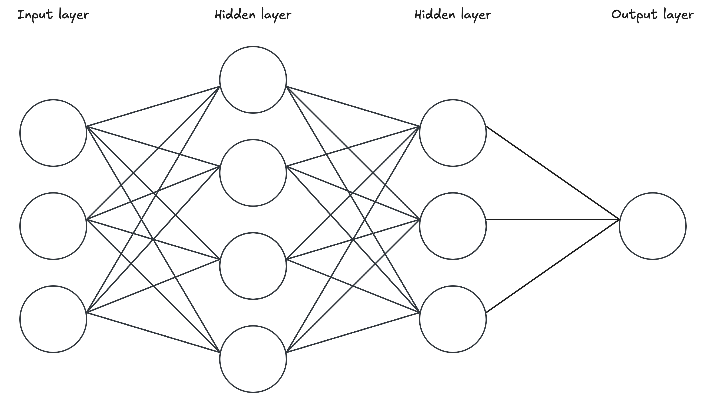
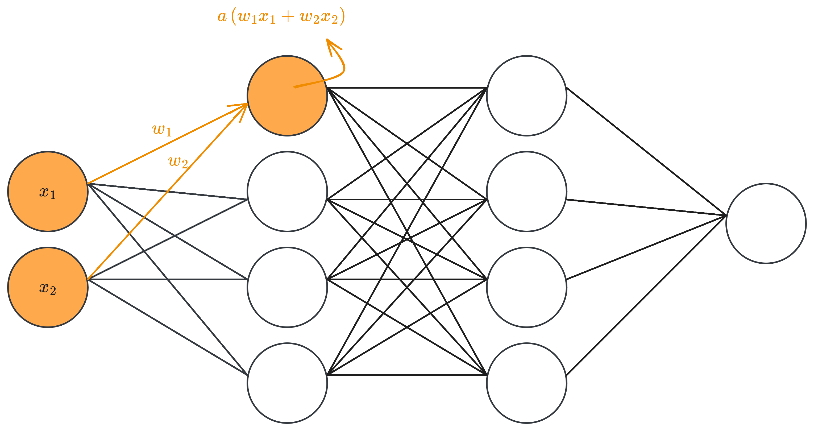

***
# Introduction

- A **neural network** is a mathematical entity loosely inspired by the human brain. It uses interconnected units (also called neurons) in a layered structure resembling the human brain.
<figure>
	
	<figcaption><b>Figure 1.</b> This is a simple neural network architecture. There are three main components: (1) the input layer, which contains the inputs to the model; (2) the hidden layers, which define the intermediate computations (or representations); and (3) the output layer, which contains the model's output.
	</figcaption>
</figure>
- Their main goal is to approximate some unknown function $f^{*}$. The network defines a mapping (i.e., a flexible mathematical entity), $y=f(x,\theta)$, that tries to best approximate this function.
- The most common neural network architecture is called **feedforward** neural network, and that's because the information flows through the function starting at the input vector ($x$), then moving through the intermediate representations, and finally to the output ($y$).
- These networks are typically represented by composing together many different functions, and are associated with a directed acyclic graph (DAG). For example, the neural network in Figure 1 could be represented as:$$f(x)=f^{(3)}\left(f^{(2)}\left(f^{(1)}(x)\right)\right)$$
	- Each function $f^{(i)}$ represents a layer in the network. In the example above, $f^{(1)}$ represents the first hidden layer, $f^{(2)}$ is the second hidden layer, and so on. The number of layers defines the depth of the model.
	- These functions are **vector-to-vector** functions, where every element in the output vector is the activation of a hidden-unit.
- During training, we want $f(x)\longrightarrow f^{*}(x)$. The training data provides us with a target output, $y$, for every training point, $x$. Thus, the training examples specify what the output layer should return at each point, i.e., given $x$ it must return a value close to $y$.
- The behavior of the hidden layers is not specified explicitly by the training data, so the learning algorithm must decide how to use these layers. Here's where the neural network learns the patterns in the data.

## Hidden-units

- Hidden-units are artificial neurons or nodes that reside within the hidden layers of a neural network. These units significantly contribute to the learning process by learning meaningful **representations** of the input data.
- Each hidden unit receives inputs from all the units in the preceding layer (this could be either the input layer or another hidden layer). These inputs are combined using a weighted sum (i.e., a linear transformation) and then passed through an activation function that introduces non-linearity to the mix, giving the neural network the capacity to learn complex patterns.
<figure>
	
	<figcaption><b>Figure 2.</b> Activation of a hidden-unit. It receives a linear transformation of the inputs of the preceding layer and then pass it through a non-linear activation function.
	</figcaption>
</figure>
- There are a lot of activation functions available, but the default recommendation is to use the **rectified linear unit** or **ReLU**. This activation function is defined as $g(z)=\max\{0, z\}$, where $z$ is the linear transformation of the inputs.
	- ReLU is so widely used because it keeps the nice properties of linear models: they’re easy to optimize and they tend to generalize well on training data.
	- When $z\leq 0$, the ReLU activation outputs zero and the gradient is also zero. However, when $z>0$ the gradient remains large, consistent and equal to one. This simple behavior is what makes the ReLU function effective at reducing the vanishing gradient problem that appears when training deep neural networks.
		- Bias terms ($b$) are often initialized to a small positive value (like $0.01$) so ReLU units are more likely to start the training process active.
	- A downside of ReLU is that if a neuron keeps getting negative inputs ($z < 0$), it outputs zero every time and its gradient stays zero. With no gradient flowing back, the weights stop updating—effectively killing the neuron.
		- There are extensions of ReLU, like **Leaky ReLU** and **Parametric ReLU**, that add a small non-zero slope $\alpha_i$ when $z_i < 0$. In that case, the activation is defined as $g_i(z_i, \alpha_i) = \max{0, z_i} + \alpha_i \min{0, z_i}$.
- Other activations like **Sigmoid** or **tanh** are usually avoided because they saturate over most of their range, which makes gradient-based learning harder.