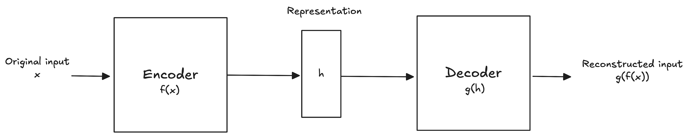

# Introducción
Los **autoencoders** son redes neuronales cuya tarea de pretexto es reconstruir los inputs que recibe. Su estructura consiste de dos partes:
- La primer parte se conoce como **encoder**, y se encarga de aprender una representación de los inputs, $h=f(x)$.
- La segunda parte se conoce como **decoder**, y se encarga de reconstruir los inputs a partir de la representación que aprende el encoder, $r=g(h)$.
Gráficamente, la estructura de un autoencoder se puede representar de la siguiente manera:

Al ser redes neuronales *feed-forward*, se entrenan usando las mismas técnicas que un MLP tradicional. Entonces, vamos a utilizar *back-propagation* para calcular los gradientes y *stochastic gradient descent* como el algoritmo de optimización que ajusta los pesos.

Ahora, un modelo cuya función es reconstruir los inputs que recibe no es particularmente útil. Lo que ocurre es que la tarea de reconstrucción es solo una tarea de pretexto, y lo que esperamos al entrenar un autoencoder con esta tarea es que la representación $h$ que aprende contenga información valiosa sobre nuestros datos.
Cómo nos podemos asegurar de que el modelo aprenda esta información? Por lo general, diseñamos los autoencoders para que no puedan reconstruir los inputs a la perfección mediante algún tipo de restricción. Al restringir el modelo, lo que logramos es que se concentre en las características más importantes para la reconstrucción.
***
# Undercomplete Autoencoders

Como ya dijimos, aplicando restricciones durante el entrenamiento, logramos que el modelo capture información relevante sobre la distribución de los datos. En particular, si lo que queremos es obtener las features que más información aportan, tenemos que restringir $h$ para que tenga una menor dimensión que $x$. De esta manera lo que hacemos es forzar al modelo para que se concentre en las features más importantes para representar los patrones en los datos.

El proceso de aprendizaje es sencillo y consiste en minimizar una **función de perdida**:
$$L(x, g(f(x)))$$
donde $L$ puede ser cualquier función que penalice a nuestro modelo por ser distinto al input $x$.
Un aspecto clave a considerar es que, si el encoder y el decoder son lineales y la función de pérdida es el error cuadrático medio (ECM), entonces el autoencoder aprende el mismo **espacio latente** que PCA. Sin embargo, la ventaja que tienen los autoencoders sobre PCA es que, si el encoder o el decoder (o ambos) son no lineales, incluso usando el ECM como función de pérdida, podemos capturar un espacio latente más complejo y no lineal.

Desafortunadamente, si no se imponen suficientes restricciones, incluso un autoencoder con un encoder y decoder lineales puede aprender a reconstruir los datos sin capturar información relevante en el proceso.
***
# Regularized Autoencoders

Como mencionamos antes, si no se limita la capacidad del encoder y el decoder, el modelo puede aprender a reconstruir los datos sin extraer información útil. Idealmente, se podría entrenar exitosamente un autoencoder ajustando la capacidad del encoder y el decoder según la complejidad de la distribución a modelar.
Existen diversas técnicas de regularización que permiten entrenar autoencoders capaces de capturar información de la distribución sin tener que limitar la capacidad del encoder o decoder. Esto se logra modificando la función de pérdida para que el modelo adquiera propiedades adicionales, más allá de simplemente reconstruir los inputs.
Nuestro autoencoder puede ser no lineal y tener una representación de mayor dimensión que $x$, pero aún así puede aprender información relevante de la distribución, incluso sin limitar la capacidad del encoder o decoder.

## Sparse Autoencoders

Los **autoencoders esparsos** se utilizan para extraer features en problemas de clasificación. Para lograr que un autoencoder sea esparso, se agrega una penalización $\Omega$ a la representación $h$. La función de pérdida se define como:
$$L(x, g(f(x)))+\Omega(h)$$
Aplicar la penalización $\Omega$ evita que el autoencoder tenga un error de reconstrucción bajo en todo el espacio.

## Denoising Autoencoders

Cuando entrenamos un **denoising autoencoder (DAE)** minimizamos la siguiente función de pérdida:
$$L(x,g(f(\tilde{x}))$$
donde $\tilde{x}$ es una versión perturbada de $x$. Es decir, la tarea de pretexto de un DAE ya no es la reconstrucción del input $x$, sino el quitar el ruido a una versión perturbada, $\tilde{x}$.
Entrenar de esta manera fuerza al encoder y al decoder a aprender de manera implícita la distribución $P(x)$ de los datos.

## Contractive Autoencoders

Los **contractive autoencoders (CAE)** se entrenan con una penalización $\Omega$ que penaliza la sensibilidad del espacio latente, $h=f(x)$, ante pequeños cambios en los inputs. Esta penalización utiliza la norma de Frobenius de la matriz Jacobiana (sencillamente, la suma de los cuadrados de los elementos de la matriz Jacobiana):
$$\Omega(h,x)=\lambda\sum_{i}||\nabla_{x}h_{i}||^{2}$$
donde $\nabla_{x}h_{i}=\frac{\partial h}{\partial x}$.
Al agregar esta penalización a la función de pérdida, obtenemos un autoencoder que, para aquellos puntos que se encuentran cerca en el espacio, también se van a encontrar cerca en el espacio latente.
Debido a que esta penalización solo se aplica a la muestra de entrenamiento, el modelo se ve forzado a ser insensible a cambios en $x$ dentro de las regiones donde existen datos de entrenamiento, pero no por fuera de ellas. Esto permite tener una mejor estimar un mejor espacio latente y obliga al modelo a aprender las características más informativas sobre la distribución $P(X)$.