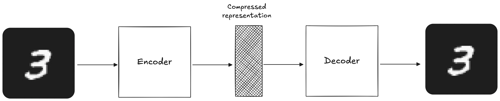
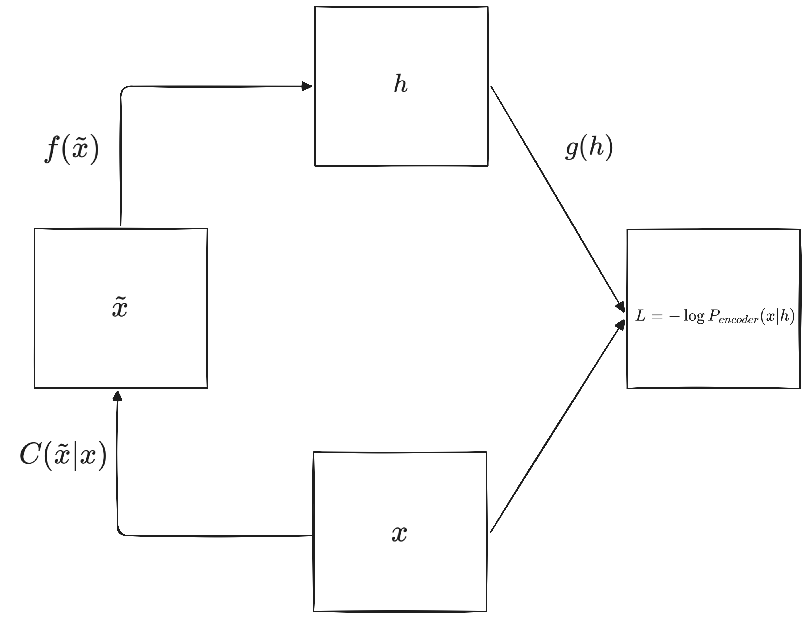

***
# Introducción

Un **autoencoder** es una red neuronal cuya tarea de pretexto (i.e., la tarea para la cual la entrenamos) es reconstruir los inputs que recibe. 
Su estructura consiste de dos partes:
- La primera parte se conoce como **encoder**, cuya tarea es aprender una representación de menor dimensión (también conocida como **espacio latente**) de los inputs, $h=f(x)$.
- La segunda parte se conoce como **decoder**, cuya tarea es reconstruir los inputs a partir del espacio latente que aprendió el encoder, $\hat{x}=g(h)$.

Gráficamente, la estructura de un autoencoder se representa de la siguiente manera:

El espacio latente generado por el encoder se conoce como "cuello de botella", y es uno de los atributos más importantes en la estructura de nuestro modelo. Este "cuello de botella" lo que hace es limitar la cantidad de información que puede circular a través de nuestra red neuronal, obligando así al modelo a aprender una representación que capture los patrones y características más importantes en los datos. *Es como viajar con una valija pequeña, en donde solo podemos guardar las cosas que realmente necesitamos.*

Al ser redes neuronales, los autoencoders se entrenan usando las mismas técnicas que usamos para un MLP tradicional: **back-propagation** para calcular los gradientes y **stochastic gradient descent** (o cualquier otro algoritmo de optimización) para ajustar los pesos.

Ahora, un modelo cuya función es reconstruir los inputs que recibe no es particularmente útil. Lo que ocurre es que la tarea de reconstrucción es solo una tarea de pretexto, y lo que esperamos al entrenar un autoencoder es que la representación $h$ contenga información valiosa sobre nuestros datos.
Cómo nos podemos asegurar de que el modelo aprenda esta información? Por lo general, diseñamos los autoencoders para que no puedan reconstruir los inputs a la perfección mediante algún tipo de restricción. Al restringir el modelo, lo que logramos es que se concentre en las características más importantes para la reconstrucción, y evitamos que aprenda una función indicadora que simplemente copie los inputs a los outputs[^1].
## Estructura: profundidad y tamaño de las capas ocultas

El **Teorema de Aproximación Universal** nos garantiza que una red neuronal con al menos una capa oculta puede representar, con un nivel de precisión arbitrario, cualquier función no lineal, siempre y cuando tenga la suficiente cantidad de neuronas.
Entonces, en principio, un encoder con una única capa oculta es suficiente para aprender el espacio latente $h$. 
Sin embargo, no solo estará limitado en el tipo de transformaciones que puede aprender, sino que tampoco será capaz de forzar ciertas propiedades sobre el espacio latente. Si agregamos más capas ocultas a nuestro encoder podríamos aprender transformaciones más complejas y forzar propiedades interesantes sobre el espacio latente $h$.

Por último, una mayor profundidad nos permite reducir los costos computacionales de aproximar algunas funciones (i.e., cuantas más capas ocultas tengamos, menos neuronas necesitamos por capa, lo que reduce la cantidad de pesos en nuestra red neuronal) y nos permite reducir la cantidad de datos necesarios para el entrenamiento.
## Encoders y Decoders Estocásticos

Una estrategia muy común al diseñar las unidades de salida y la función de pérdida de una red neuronal es definir primero una distribución para el output, $P(y|x)$. La función de perdida tiene que ser igual a menos la log-verosimilitud de la distribución, $-\log{P(y|x)}$. Por ejemplo, para los casos de clasificación binaria, la función de pérdida $L$ es la entropía cruzada binaria, la cual obtenemos de asumir que $P(y|x)$ sigue una distribución Bernoulli.
Esta misma técnica se puede aplicar para entrenar los autoencoders. Entonces, dada la representación $h$ y el output $\hat{x}$, el output del decoder sigue una distribución $P_{decoder}(\hat{x}|h)$. La función de pérdida es igual a menos la log-verosimilitud,  $-\log{P_{decoder}(\hat{x}|h)}$, cuya forma funcional depende de los supuestos que hagamos sobre $P_{decoder}(\hat{x}|h)$.

Podemos también generalizar esta idea al encoder, donde asumimos que su output tiene la siguiente distribución, $P_{encoder}(h|x)$.
***
# Tipos de Autoencoders
## Undercomplete Autoencoders

Como ya dijimos, aplicando restricciones durante el entrenamiento podemos lograr que el modelo capture características relevantes sobre los patrones en los datos. Una manera de hacer esto es restringir $h$ para que tenga una menor dimensión que $x$. De esta manera forzamos al modelo para que se concentre en las features más importantes para representar los patrones en los datos.

El proceso de aprendizaje es igual al de una red neuronal tradicional, y consiste en minimizar una **función de perdida**:
$$L(x, \hat{x})$$
donde $L$ puede ser cualquier función que penalice al modelo cuando la reconstrucción $\hat{x}$ es distinta del input $x$.

Un aspecto clave a considerar es que, si el encoder y el decoder son lineales y la función de pérdida es el error cuadrático medio (ECM), entonces el autoencoder aprende la misma **representación** que PCA. Sin embargo, la ventaja que tienen los autoencoders sobre métodos de reducción de dimensionalidad como PCA es que, si el encoder o el decoder (o ambos) son no lineales, incluso usando el ECM como función de pérdida, podemos capturar un espacio latente más complejo y no lineal que el de PCA.
Desafortunadamente, si no se imponen suficientes restricciones, incluso un autoencoder con un encoder y decoder no lineales puede aprender a reconstruir los datos sin capturar información relevante en el proceso. En teoría, podría ocurrir que el encoder logre representar cada observación de la muestra de entrenamiento, $X$, con un índice $i$. En ese caso, el decoder solo tiene que aprender a mapear los índices $i$ con las observaciones $x^{(i)}$. Esto no ocurre en la práctica, pero es un buen ejemplo de como los autoencoders pueden aprender a realizar la tarea de pretexto sin aprender nada acerca de la distribución de los datos.
## Regularized Autoencoders

Como mencionamos antes, si no se limita la capacidad del encoder y el decoder, el modelo puede aprender a reconstruir los datos sin extraer información útil. 
Idealmente, se podría entrenar exitosamente un autoencoder ajustando la capacidad del encoder y el decoder según la complejidad de la distribución a modelar. Sin embargo, existen diversas técnicas de regularización que nos permiten entrenar autoencoders capaces de capturar información acerca de la distribución de los datos, sin tener que limitar la capacidad del encoder y el decoder. 
Esto se logra modificando la función de pérdida para que el modelo adquiera propiedades adicionales, más allá de simplemente reconstruir los inputs.
### **Sparse Autoencoders**

Los **autoencoders esparsos** nos permiten reducir la cantidad de información que fluye por la red neuronal sin tener que reducir la cantidad de neuronas en nuestras capas ocultas o espacio latente. Para esto tenemos que agregar a la función de pérdida un término de penalización, $\Omega$, que penaliza cuando una o más neuronas se activan frecuentemente.
$$L(x, \hat{x})+\Omega(h)$$
Una consecuencia de utilizar este término de penalización es que neuronas individuales se especializan en detectar características o patrones particulares en los datos. De esta manera logramos que distintas regiones de la red neuronal se activen dependiendo de los datos que recibe.
Otra ventaja de este método es que logramos evitar que la red neuronal sobre-ajuste a los datos, sin limitar su capacidad para aprender los patrones en los datos.
### **Denoising Autoencoders**

Un **denoising autoencoder (DAE)** es un autoencoder que recibe una versión perturbada de los datos, $\tilde{x}$, y a partir de ella intentar predecir la versión original. En otras palabras, la tarea de pretexto del autoencoder ya no es reconstruir el input $x$, sino quitarle el ruido a una versión perturbada, $\tilde{x}$.

Entrenarlo de esta manera fuerza a que el autoencoder aprenda de manera implícita la distribución $P(x)$ de los datos.
### **Contractive Autoencoders**

Los **contractive autoencoders (CAE)** se entrenan con un término de penalización, $\Omega$, que penaliza la sensibilidad del espacio latente, $h=f(x)$, ante pequeños cambios en los inputs. Esta penalización utiliza la norma de Frobenius de la matriz Jacobiana (sencillamente, la suma de los cuadrados de los elementos de la matriz Jacobiana):
$$\Omega(h,x)=\lambda\sum_{i}||\nabla_{x}h_{i}||^{2}$$
donde $\nabla_{x}h_{i}=\frac{\partial h}{\partial x}$.
Al agregar esta penalización a la función de pérdida, nos aseguramos de que aquellos puntos que se encuentran cerca en el espacio de mayor dimensionalidad, también se encuentren cerca en el espacio latente de menor dimensión. 
Debido a que esta penalización solo se aplica a la muestra de entrenamiento, el modelo se ve forzado a ser insensible a cambios en $x$ dentro de las regiones donde existen datos de entrenamiento, pero no por fuera de ellas. Esto nos permite estimar un mejor espacio latente y obliga al modelo a aprender las características más informativas sobre la distribución $P(X)$.
***
# Resources
- \[1\] I. Goodfellow, Y. Bengio, and A. Courville, _Deep Learning_. Cambridge, MA: MIT Press, 2016. \[Online\]. Available: [http://www.deeplearningbook.org](http://www.deeplearningbook.org/).
- \[2\] J. Jordan, "Introduction to autoencoders.", *Jeremy Jordan*, 19 Mar 2018. \[Online\]. Available: [https://www.jeremyjordan.me/autoencoders/](https://www.jeremyjordan.me/autoencoders/).