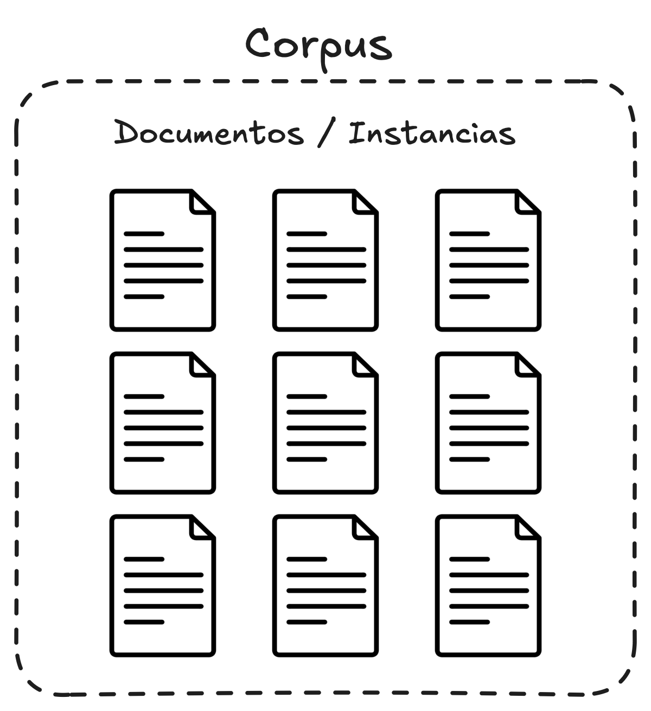

***

# Definiciones

- **Corpus (pl. corpora).** Se refiere a un conjunto de datos, recopilados de manera cuidadosa, a veces anotados y/o curados.
- **Documentos/Instancias.** Los elementos que componen un corpus se conocen como documentos o instancias.
	- Si quisiéramos hacer un paralelismo con los datasets que generalmente utilizamos en ML, un documento es equivalente a una observación.
<figure>
	
</figure>
- **Vocabulario.** Cuando hablamos de vocabulario nos referimos a todas las palabras (sin duplicados) que podemos encontrar en nuestro corpus. Definimos $|V|$ como el tamaño del vocabulario.
- **Palabras.** Definir que es una palabra es una tarea muy difícil porque depende de la tarea que intentamos desarrollar. Algunos factores que contribuyen a que esta tarea sea tan difícil son:
	- Los signos de puntuación como el punto (`.`) y la coma (`,`) suele ser muy útiles determinar límites entre las palabras, pero dependiendo de la tarea en la que estemos trabajando, puede que nos convenga considerar estos signos de puntuación como palabras.
	- En los corpus que contienen texto proveniente de conversaciones, los cuales suelen introducir **fragmentos** de palabras (e.g., cuando decimos *"por?"* en vez de decir *"por qué?"*) o **fillers** (e.g., cuando entre palabras decimos *"ehhh"*), tenemos que decidir si las vamos a considerar palabras o no. Esto también va a depender de la tarea en la que estemos trabajando (e.g., en tareas de *speech recognition* suelen ser consideradas palabras porque nos ayudan a predecir la siguiente palabra en la conversación).

# Text normalization

## Tokenization

- Es un proceso que consiste en separar textos en unidades individuales conocidas como **tokens**.
- Los tokens pueden representar varias cosas: una palabra, una letra, un morfema, una sílaba, una frase, etc. Eso depende de la tarea en la que estemos trabajando y en lo que haga sentido para la misma.
- Existen distintos tipos. Cual utilizamos depende de la tarea que estemos realizando.
	- **Word Tokenization.** Divide el texto en palabras individuales. Suele ser muy útil para analizar el sentimiento de un texto o para generar resúmenes.
	- **Character Tokenization.** Divide el texto en caracteres. Suele ser muy utilizado para la corrección de texto o para modelos de lenguajes (para idiomas con morfologías complejas).
	- **Sub-word Tokenization.** Divide el texto en palabras o morfemas. Suele ser utilizado por modelos como BERT (LLMs), porque a partir de estos tokens se pueden crear palabras que el modelo no vio durante el entrenamiento.
		- Por ejemplo, un modelo entrenado con un corpus en español puede que no se haya encontrado durante el entrenamiento con la palabra "*boludo*" que utilizamos los argentinos. Sin embargo, si se utilizó este tipo de tokens durante el entrenamiento, va a poder entender esta palabra al concatenar tokens.
		- Es muy útil para reducir el tamaño de los vocabularios.
	- **Sentence Tokenization.** Divide el texto en frases o sentencias más cortas.
	- **N-gram Tokenization.** Los tokens son secuencias de $n$ palabras. Muy útil cuando se quiere capturar el contexto en donde se están utilizando estas palabras.
- Hay varios métodos para extraer tokens de un texto:
	- **Ruled-based Tokenization.** Utiliza un conjunto de reglas pre-definido para separar el texto en tokens. Por ejemplo, utilizar los espacios en blanco.
	- **Statistical Tokenization.** Utiliza modelos estadísticos para encontrar los límites entre los tokens.
		- Suele ser muy útil para idiomas como el japonés o el chino, donde no se utilizan espacios en blanco para separar las palabras. Sin embargo, requieren que el modelo esté bien entrenado.
	- **Byte-Pair Encoding (BPE).** Combina los caracteres que ocurren con mayor frecuencia.
	- **ML-based Tokenization.** Utiliza algoritmos de ML para aprender reglas a partir de anotaciones en los textos. Estos métodos son muy flexibles y se pueden utilizar para varios idiomas.

## 📚 Recursos
- (2024, June 25) *What is Tokenization in Natural Language Processing (NLP)?*. GeeksforGeeks. [URL](https://www.geeksforgeeks.org/tokenization-in-natural-language-processing-nlp/).
- (2024, November 15) *Mastering Tokenization in NLP: An In-Depth Look at Methods, Types, and Challenges*. Calibrant. [URL](https://www.calibraint.com/blog/understanding-tokenization-in-nlp-guide).