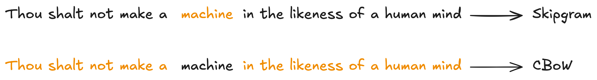
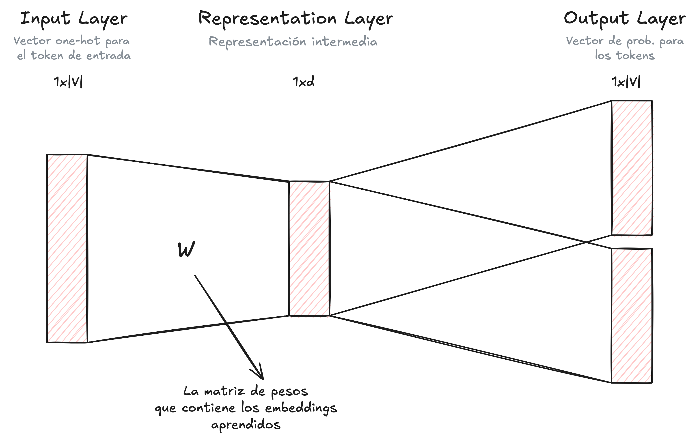
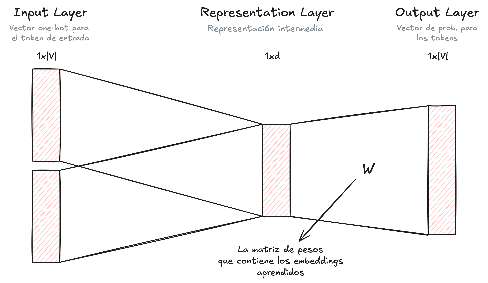

***
# Motivación

- Una vez tokenizado nuestro corpus, utilizando alguna de las técnicas de tokenización como las que describimos [anteriormente](00-intro.md), debemos convertir nuestro vocabulario (i.e., tokens) a una representación numérica.
- Una posible solución es utilizar el método de *One-Hot Encoding*. Este método consiste en generar, para cada token, un vector de largo $|V|$ (i.e., tamaño de nuestro vocabulario) que tenga un $1$ en la posición/índice correspondiente a ese token, y $0$ en el resto de las posiciones.
	- Esto método tiene varios problemas:
		- **Dimensión de los vectores.** La dimensión de nuestros vectores aumenta con el tamaño de nuestro vocabulario. Si el tamaño de nuestro vocabulario es muy grande, entonces vamos a tener vectores con muchas dimensiones (demasiadas!).
		- **Matemáticamente incómodos.** Sin vectores ralos (i.e., tienen muchos ceros). Esto los hace muy incómodos para realizar operaciones matemáticas.
		- **Ortogonalidad.** Todos los vectores son ortogonales. Esto quiere decir que no aportan información relevante sobre las palabras.
- Nos gustaría que nuestras representaciones vectoriales incluyan información sintáctica del token. Otra información importante que los vectores deberían incluir es información de contexto.
	- Según la *semántica distribucional*, el significado de una palabra depende de como se utiliza y en qué contexto.

# Word Embeddings

- Los embeddings son representaciones vectoriales, de baja dimensionalidad, que contienen información semántica relevante sobre nuestros tokens.
- Lo bueno es que estas representaciones se encuentran en un mismo espacio vectorial, y conservan propiedades semánticas y geométricas que nos permiten que tokens similares tengan embeddings cercanos en el espacio.

## LSA

- Consiste en aplicar una reducción de dimensionalidad, utilizando PCA o SVD, sobre una matriz de frecuencia. De esta manera podemos obtener mejores representaciones vectoriales.
- La matriz de frecuencia la construimos con todos los documentos de nuestro corpus. Lo que hacemos es contar cuantas veces aparece el token en cada documento, generando así un vector de frecuencias para cada token.
	- La idea es que los tokens que tienen alguna relación semántica van a tener vectores similares porque aparecen con mayor frecuencia en los mismos documentos.
	- Algunos problemas con estos vectores:
		- Son ralos.
		- La dimensionalidad depende de la cantidad de documentos en nuestro corpus.
		- El tiempo de ejecución crece más que linealmente cuando agregamos más documentos a nuestro corpus.

## Similaridad Coseno

- Podemos usar la similaridad coseno para entender si dos tokens son similares o no. $$cossim(\bar{v}_{1},\bar{v}_{2})=\text{cos}(\text{angle})=\frac{\bar{v}_{1}\cdot\bar{v}_{2}}{|\bar{v}_{1}|\cdot|\bar{v}_{2}|}\in[-1,1]$$
- La idea es la siguiente:
	- Cuando $cossim(\bar{v}_{1},\bar{v}_{2})=1$, entonces el ángulo entre ambos vectores es de $0$ grados, es decir, el vector es el mismo.
	- Cuando $cossim(\bar{v}_{1},\bar{v}_{2})=0$, entonces el ángulo entre ambos vectores es de $90$ grados, es decir, los vectores son ortogonales. 
		- Los vectores no comparten información relevante entre sí, y no hay ninguna relación semántica entre ellos.
	- Cuando $cossim(\bar{v}_{1},\bar{v}_{2})=-1$, entonces el ángulo entre ambos vectores es de $180$ grados, es decir, los vectores son opuestos. 
		- Los vectores están relacionados conceptualmente pero son opuestos en cuanto a la semántica.

# Word2Vec

- Los autores introducen un método muy eficiente para generar embeddings. Estos embeddings se pueden entrenar sobre corpus muy grandes y mejoran mucho la performance en tareas downstream.
- La idea es entrenar un modelo sobre una tarea auxiliar (predecir una o más palabras), y utilizar las representaciones vectoriales que aprendió el modelo durante el entrenamiento como embeddings.
	- Muy parecido a lo que ocurre con los autoencoders, en donde no nos interesa la tarea auxiliar, solo nos interesa las representaciones que aprende el modelo cuando lo entrenamos.
	- A diferencia de otros métodos, que sólo utilizan las últimas $N$ palabras de la oración, Word2Vec utiliza todo el contexto, es decir, utiliza las palabras antes y después de la palabra que queremos predecir. Esto nos permite generar mejores embeddings.
- Hay dos posibles tareas auxiliares (dependiendo de que tarea elijamos, la arquitectura de nuestro modelo va a cambiar) para entrenar nuestro modelo.
	- **Skip-gram.** Dada una palabra, queremos predecir las palabras del contexto (ventana móvil que definimos nosotros).
	- **Continuous Bag of Words (CBoW).** Dadas las palabras del contexto, predecir la palabra del centro.
<figure>
	
</figure>

- Para construir el embedding de la palabra *padre*, vamos a mirar las palabras (o tokens) que la acompaña con mayor frecuencia. De esa manera, si la palabra *padre* suele estar acompañada por la palabra *hijo*, entonces ambas palabras van a tener embeddings similares.

## Skip-gram

- En este caso, nuestra tarea auxiliar consiste en predecir el contexto a partir de una única palabra.
- La salida de nuestra red neuronal son vectores de dimensión $|V|$ (tamaño del vocabulario) con la probabilidad para cada uno de los tokens en nuestro vocabulario de pertenecer al contexto.
<figure>
	
</figure>

- La matriz de pesos, $W$, que aprende el modelo durante el entrenamiento es una matriz de dimensión $V\times d$, donde cada fila representa el embedding de uno de los tokens del vocabulario.
- La dimensión $d$ de los embeddings determina cuanta información vamos a incluir.
	- Si $d>>0$, entonces los embeddings van a estar muy separados.
	- Si $d<<0$, entonces los embeddings van a estar muy cerca.

## CBoW

- En este caso, nuestra tarea auxiliar consiste en predecir una palabra a partir del contexto.
- La salida del modelo es un único vector, de dimensión $|V|$, con la probabilidad que tiene cada token en el vocabulario de ser la palabra que buscamos predecir.
<figure>
	
</figure>

## Negative Sampling

- Si el tamaño de nuestro vocabulario es muy grande, entonces actualizar los pesos de todos los $|V|$ embeddings en cada paso del entrenamiento es computacionalmente muy costoso e ineficiente.
- La solución que plantean los autores se conoce como *negative sampling*. La idea es actualizar los pesos solo de un grupo acotado de palabras en nuestro vocabulario, haciendo más eficiente el entrenamiento del modelo.
	1. Primero tenemos que extraer de nuestro corpus un par de palabras, donde la primera palabra es la que queremos predecir y la segunda palabra es el contexto. Esto se conoce como *positive example* (porque ocurren al mismo tiempo).
		- Un ejemplo sería $(\text{perro}, \text{amigo})$.
	2. Seleccionamos aleatoriamente $k$ palabras que no aparecen en la ventana de contexto, y con ella generamos $k$ nuevos pares. Estos son los *negative examples* que vamos a utilizar para el entrenamiento.
		- Un ejemplo sería $(\text{perro}, \text{telescopio})$.
	3. Para cada par de palabras, entrenamos el modelo para que nos devuelve $1$ si es el *positive example* y $0$ si es un *negative sample*. Es decir, entrenamos a nuestro modelo para que nos diga si un par de palabras es real, como $(\text{perro}, \text{amigo})$, o es ficticio, como $(\text{perro}, \text{telescopio})$. Para eso utilizamos una función de pérdida logística.
	4. Una vez calculada la función de pérdida, computamos los gradientes y actualizamos los pesos de la palabra que buscamos predecir (en nuestro ejemplo, $\text{perro}$), el contexto (en nuestro ejemplo, $\text{amigo}$) y las palabras seleccionadas aleatoriamente (en nuestro ejemplo, $\text{telescopio}$).

***
## 📚 Recursos
- Alammar, Jay. _The Illustrated Word2vec_. Jay Alammar, 19 Nov. 2017, [https://jalammar.github.io/illustrated-word2vec/](https://jalammar.github.io/illustrated-word2vec/).