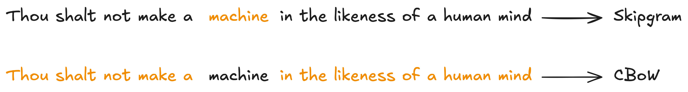
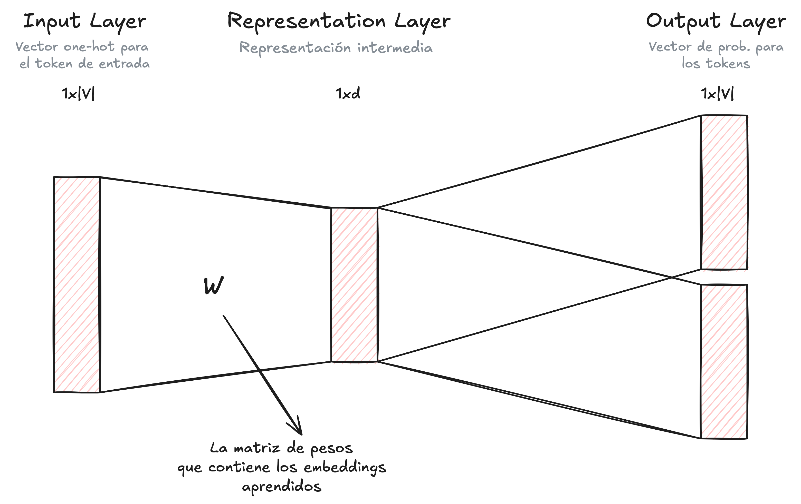
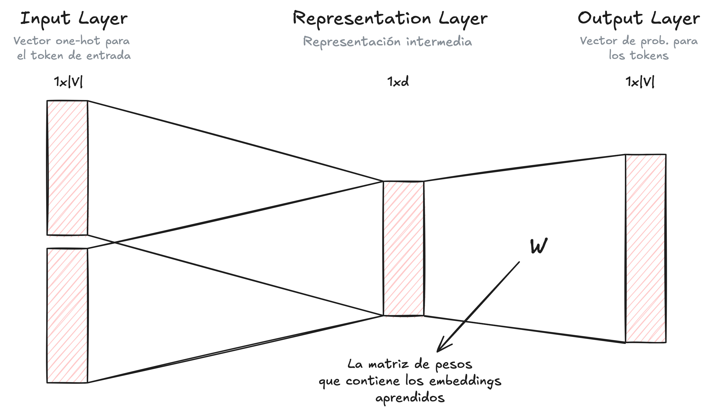

2025-10-18 23:01

Status: #Ongoing 

Tags: [[Natural Language Processing]]
***
# Motivation

- Once our corpus is tokenized, using one of the tokenization techniques like the ones we described earlier, we must convert our vocabulary (i.e., tokens) into a numerical representation.
- One possible solution is to use the *One-Hot Encoding* method. This method consists of generating, for each token, a vector of length $|V|$ (i.e., size of our vocabulary) that has a $1$ in the position/index corresponding to that token, and $0$ in the rest of the positions.
	- This method has several problems:
		- **Dimension of vectors.** The dimension of our vectors increases with the size of our vocabulary. If the size of our vocabulary is very large, then we will have vectors with many dimensions (too many!).
		- **Mathematically inconvenient.** They are sparse vectors (i.e., they have many zeros). This makes them very inconvenient for performing mathematical operations.
		- **Orthogonality.** All vectors are orthogonal. This means they do not provide relevant information about the words.
- We would like our vector representations to include syntactic information of the token. Another important information that the vectors should include is context information.
	- According to *distributional semantics*, the meaning of a word depends on how it is used and in what context.

# Word Embeddings

- Embeddings are vector representations, of low dimensionality, that contain relevant semantic information about our tokens.
- The good thing is that these representations are in the same vector space, and preserve semantic and geometric properties that allow us to have similar tokens with close embeddings in space.

## LSA

- It consists of applying dimensionality reduction, using PCA or SVD, on a frequency matrix. This way we can obtain better vector representations.
- We construct the frequency matrix with all documents in our corpus. What we do is count how many times each token appears in each document, thus generating a frequency vector for each token.
	- The idea is that tokens that have some semantic relationship will have similar vectors because they appear more frequently in the same documents.
	- Some problems with these vectors:
		- They are sparse.
		- The dimensionality depends on the number of documents in our corpus.
		- The execution time grows more than linearly when we add more documents to our corpus.

## Cosine Similarity

- We can use cosine similarity to understand if two tokens are similar or not. $$cossim(\bar{v}_{1},\bar{v}_{2})=\text{cos}(\text{angle})=\frac{\bar{v}_{1}\cdot\bar{v}_{2}}{|\bar{v}_{1}|\cdot|\bar{v}_{2}|}\in[-1,1]$$
- The idea is as follows:
	- When $cossim(\bar{v}_{1},\bar{v}_{2})=1$, then the angle between both vectors is $0$ degrees, that is, the vector is the same.
	- When $cossim(\bar{v}_{1},\bar{v}_{2})=0$, then the angle between both vectors is $90$ degrees, that is, the vectors are orthogonal. 
		- The vectors do not share relevant information with each other, and there is no semantic relationship between them.
	- When $cossim(\bar{v}_{1},\bar{v}_{2})=-1$, then the angle between both vectors is $180$ degrees, that is, the vectors are opposite. 
		- The vectors are related conceptually but are opposite in terms of semantics.

# Word2Vec

- The authors introduce a very efficient method for generating embeddings. These embeddings can be trained on very large corpora and greatly improve performance on downstream tasks.
- The idea is to train a model on an auxiliary task (predict one or more words), and use the vector representations that the model learned during training as embeddings.
	- Very similar to what happens with autoencoders, where we are not interested in the auxiliary task, we are only interested in the representations that the model learns when we train it.
	- Unlike other methods, which only use the last $N$ words in the sentence, Word2Vec uses the entire context, that is, it uses the words before and after the word we want to predict. This allows us to generate better embeddings.
- There are two possible auxiliary tasks (depending on which task we choose, the architecture of our model will change) to train our model.
	- **Skip-gram.** Given a word, we want to predict the context words (a sliding window that we define).
	- **Continuous Bag of Words (CBoW).** Given the context words, predict the center word.
<figure>
	
</figure>

- To build the embedding of the word *father*, we are going to look at the words (or tokens) that accompany it most frequently. That way, if the word *father* is usually accompanied by the word *son*, then both words will have similar embeddings.

## Skip-gram

- In this case, our auxiliary task consists of predicting the context from a single word.
- The output of our neural network is vectors of dimension $|V|$ (size of the vocabulary) with the probability for each of the tokens in our vocabulary of belonging to the context.
<figure>
	
</figure>

- The weight matrix, $W$, that the model learns during training is a matrix of dimension $V\times d$, where each row represents the embedding of one of the tokens in the vocabulary.
- The dimension $d$ of the embeddings determines how much information we will include.
	- If $d>>0$, then the embeddings will be very far apart.
	- If $d<<0$, then the embeddings will be very close.

## CBoW

- In this case, our auxiliary task consists of predicting a word from the context.
- The output of the model is a single vector, of dimension $|V|$, with the probability that each token in the vocabulary has of being the word we want to predict.
<figure>
	
</figure>

## Negative Sampling

- If the size of our vocabulary is very large, then updating the weights of all $|V|$ embeddings at each training step is computationally very expensive and inefficient.
- The solution proposed by the authors is known as *negative sampling*. The idea is to update the weights of only a limited group of words in our vocabulary, making the model training more efficient.
	1. First we need to extract from our corpus a pair of words, where the first word is the one we want to predict and the second word is the context. This is known as a *positive example* (because they occur at the same time).
		- An example would be $(\text{dog}, \text{friend})$.
	2. We randomly select $k$ words that do not appear in the context window, and with it we generate $k$ new pairs. These are the *negative examples* that we will use for training.
		- An example would be $(\text{dog}, \text{telescope})$.
	3. For each pair of words, we train the model to return $1$ if it is the *positive example* and $0$ if it is a *negative sample*. That is, we train our model to tell us whether a pair of words is real, like $(\text{dog}, \text{friend})$, or is fictional, like $(\text{dog}, \text{telescope})$. For that we use a logistic loss function.
	4. Once the loss function is calculated, we compute the gradients and update the weights of the word we want to predict (in our example, $\text{dog}$), the context (in our example, $\text{friend}$) and the randomly selected words (in our example, $\text{telescope}$).

# References

- Alammar, Jay. _The Illustrated Word2vec_. Jay Alammar, 19 Nov. 2017, [https://jalammar.github.io/illustrated-word2vec/](https://jalammar.github.io/illustrated-word2vec/).